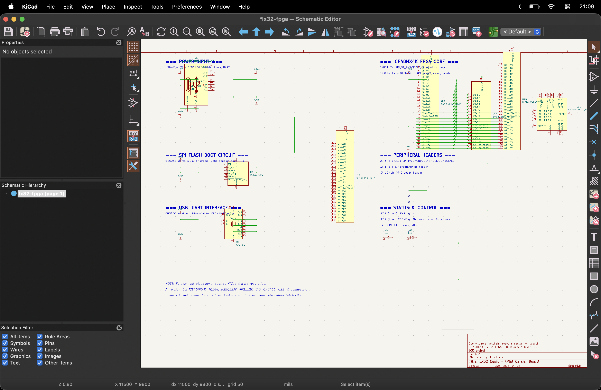

# lx32

I built a computer from scratch because ChatGPT told me "no hay huevos." So here we are.

Custom processor, custom PCB, custom compiler. The whole thing.

---

## ok first let me flex


Zero violations. Zero unconnected items. I cried a little.

(also this is the 5th time I rewrote this README. if it still looks AI-generated I give up)

---

## what is this actually

lx32 is a 32-bit CPU with a custom instruction set, running on a custom PCB, compiled by a custom LLVM backend. You can write C, compile it, and it runs on this thing.

I wanted to actually understand how computers work, not just read about it. So I built one.

The board is 80x60mm, about the size of a credit card. Black soldermask, gold finish.

---

## the board

Here's what it looks like:


The schematics:



Measurements:

Long:


Width:


Full view:


The main chip is a Lattice iCE40HX4K FPGA — that's what becomes the processor. I chose it because the toolchain is fully open source (Yosys, nextpnr, icepack).

The rest of the board is USB-C for power and programming, SPI flash so the bitstream loads on power-up, two LDOs for the separate 3.3V and 1.2V rails, a USB-UART bridge to talk to it from my laptop, 32KB of external SRAM, and a VGA header. There's also an OLED that shows register values and the current instruction live, which is the coolest part honestly.

3D render, front:


3D render, back:


`.STEP` file if you want it: [`lx32-fpga.step`](./cad/lx32-fpga.step)

---

## the processor

32 registers, fixed 32-bit instruction width, single-cycle. I made up the instruction encoding: ADD, SUB, AND, OR, XOR, shifts, loads, stores, branches, jumps, LUI, AUIPC. x0 is hardwired to zero. Everything is in `rtl/` and every module has a spec in `docs/rtl/`.

---

## how I know it works

I wrote a Rust model of the processor, then a fuzzer that fires random instruction sequences through both Verilator and the model at the same time and compares cycle by cycle.

| module | test vectors | result |
|---|---|---|
| ALU | 100,000,000 | passed |
| Branch Unit | 100,000,000 | passed |
| Control Unit | 100,000,000 | passed |
| Register File | 100,000,000 | passed |
| Full System | 100,000,000 | passed |
| **Total** | **1,100,000,000+** | **zero failures** |

Runs in under 75 seconds. I also tortured my laptop with a Python script to run it on loop. There are Coq proofs for some properties and formal verification through sby too.

---

## the compiler

LLVM backend for lx32 — instruction patterns, register file, calling convention. Eight programs compile and run end-to-end: return, pointer store, call chain, branch/loop, compare/assign, pointer walk, iterative fibonacci, recursive fibonacci.

Write C, compile with LLVM, runs on this board.

---

## the gold art

ENIG means the exposed copper comes out gold on black soldermask. I put personal stuff on both sides.

The back has an infinity symbol, *pototo ralora arerita*, *"All we need is love"*, `Lizzie <3`, `22/03/09`, and `67` (that last one I didn't choose, it just ended up there).

It's a working computer and it also has my whole heart on it.

---

## run it yourself

```bash
git clone https://github.com/Axel84727/lx32.git
cd lx32
make setup
```

You'll need: `verilator`, Rust (`cargo`), `coqc`, `sby`, `yosys`, `z3`, `g++`.

```bash
make sim TB=lx32_system_tb    # full system sim
make validate                  # full test suite (1.1B vectors)
make formal-all                # formal proofs
```

---

## BOM

Full BOM: [`lx32-bom.csv`](./lx32-bom.csv)

| Part | Qty | Total |
| :--- | :---: | ---: |
| Custom LX32 PCB (JLCPCB, 4-layer, ENIG, black mask) | 5 | $15.00 |
| Lattice iCE40HX4K-TQ144 | 2 | $19.00 |
| CH340C USB-UART (SOP-16) | 2 | $0.90 |
| W25Q32JVSSIQ SPI Flash 32Mb | 2 | $1.10 |
| AP2112K-3.3TRG1 LDO 3.3V | 2 | $0.60 |
| AP2112K-1.2TRG1 LDO 1.2V | 2 | $0.60 |
| 25MHz Crystal SMD 3225 | 2 | $0.70 |
| USB-C connector SMD | 2 | $0.80 |
| Microchip 23K256 SPI SRAM (SOIC-8) | 2 | $1.20 |
| VGA 2x5 header + 68Ω resistors | -- | $0.76 |
| Passives (caps, resistors, LEDs) | -- | $0.58 |
| 2.54mm pin headers | 1 | $0.80 |
| M3 standoffs + screws | 12 | $1.00 |
| 0.96" OLED display | 1 | $14.22 |
| Jumper wires + breadboard | 1 | $9.89 |
| Shipping JLCPCB to Uruguay | -- | $22.00 |
| Shipping Tiendamia | -- | $38.00 |
| **Total** | | **$127.15** |

---

MIT
