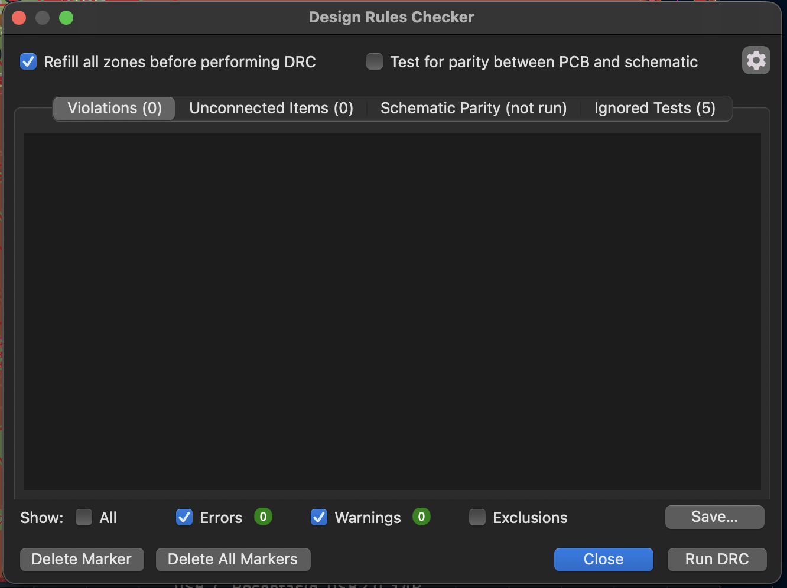
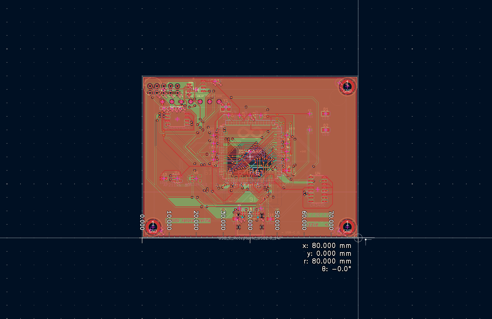
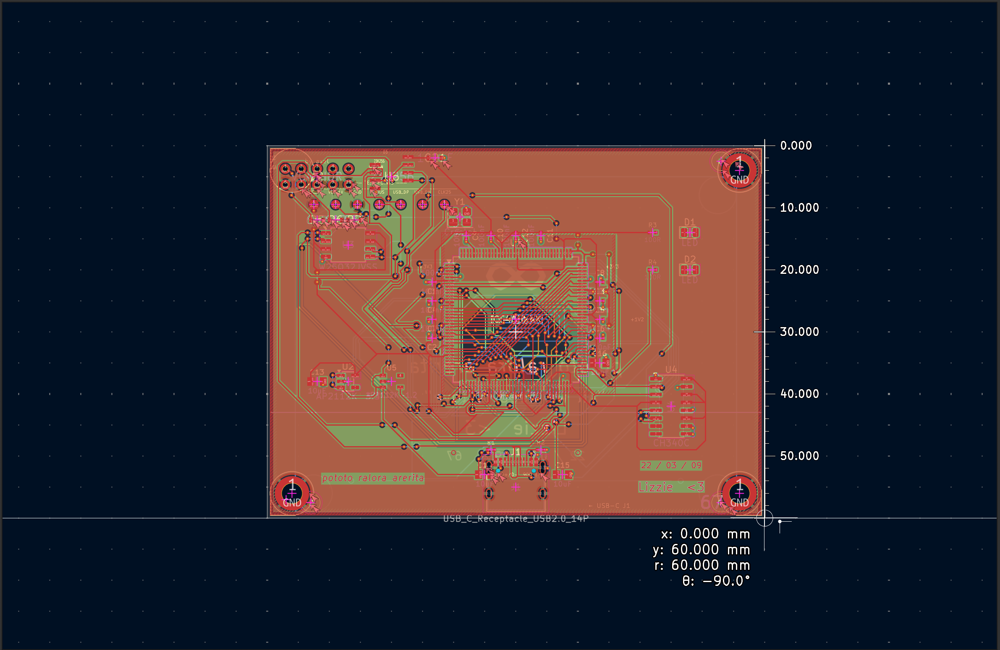
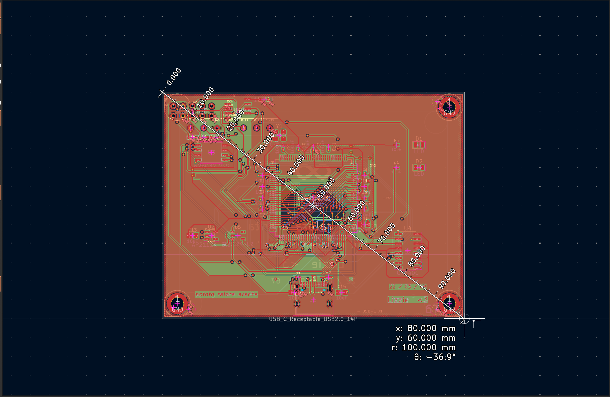
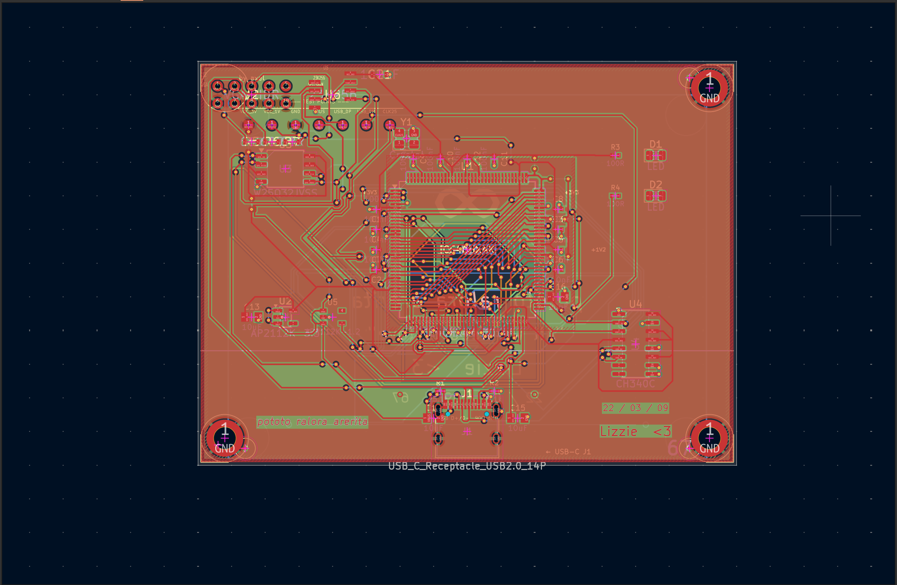
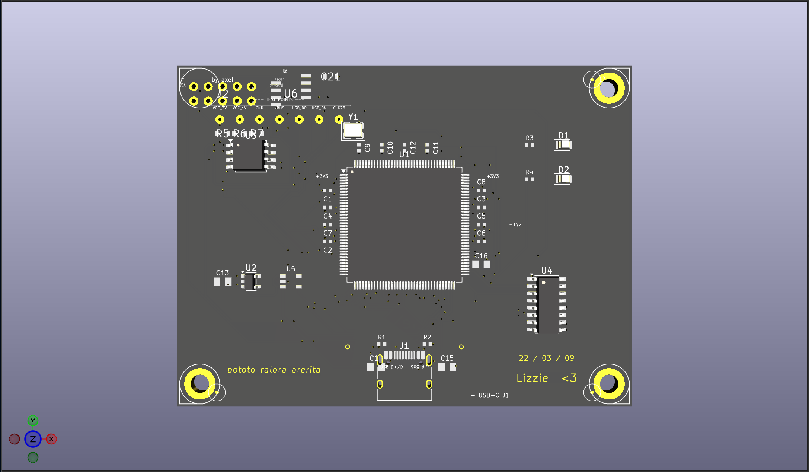
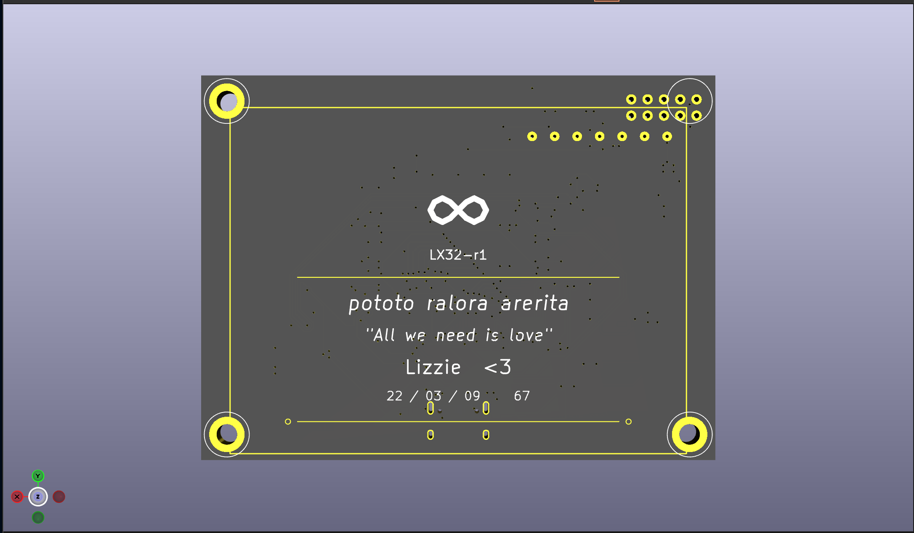

# lx32

I built a computer from scratch. A computer — custom processor, custom chip board, custom compiler. 

---
## First of all 

Let me flex the victory against the DRC :)

---
## What even is this

lx32 is a 32-bit CPU that I designed myself, running on an FPGA that sits on a PCB I also designed myself, compiled by an LLVM backend I also wrote myself.

The processor has 32 registers, a fixed 32-bit instruction width, and a single-cycle pipeline. It can do arithmetic, memory loads/stores, branches, jumps — everything a real processor does. I made up the instruction set.

The board is 80×60mm — a little smaller than a credit card. Black soldermask, gold finish (ENIG). It plugs in over USB-C and boots from a flash chip on the board.

I took some pictures of the measures!

Long:


Width:


Full(and diagonal):

---

## The board


The board centers on a **Lattice iCE40HX4K** FPGA. That's the chip that becomes the processor. I picked it because the entire toolchain is open source — Yosys synthesizes the design, nextpnr does place-and-route, icepack packs the bitstream. No vendor software. No license key. No black box.

Everything else on the board is support hardware:

- **USB-C** — power in and programming port
- **SPI flash** (W25Q32JV, 32Mbit) — stores the processor bitstream so it loads automatically on power-up
- **Two LDOs** — the iCE40 needs 3.3V for I/O and 1.2V for its core; these are completely separate rails
- **CH340C** USB-UART bridge — lets me talk to the processor from my laptop
- **23K256 SPI SRAM** — 32KB of external data memory for the processor to use
- **VGA header** — the processor can drive a monitor through 68Ω series resistors to FPGA GPIO
- **Crystal oscillator** (25 MHz) — the clock
- Status LEDs, mounting holes, decoupling caps everywhere they're supposed to be

And it looks like this!


I also leave a .STEP file on [`.step file`](./cad/lx32-fpga.step)

But I'll let 2 pictures from the back and the front so you don't have to open it :)

Front:


Back: 


### Board specs

| thing | value |
|---|---|
| dimensions | 80 × 60 mm |
| layers | 4 (F.Cu + B.Cu + In1.Cu + In2.Cu) |
| surface finish | ENIG (gold) |
| soldermask | black |
| min trace | 0.2 mm (USB diff pair) |
| vias | 216 |
| pads | 287 |
| unrouted | 0 |

---

## The processor

The lx32 CPU lives in `rtl/`. It's SystemVerilog.

| thing | value |
|---|---|
| data width | 32-bit |
| registers | 32 (x0 is always zero) |
| instruction width | fixed 32-bit |
| pipeline | single-cycle |

Instructions: ADD, SUB, AND, OR, XOR, shifts, loads, stores, branches, jumps, LUI, AUIPC. I designed the encoding myself.

Every module has a spec under `docs/rtl/`.

---

## How I know it works

I wrote a Rust program that models the processor exactly. Then I wrote a fuzzer that generates random instruction sequences, runs them on the real hardware simulation (Verilator) and on my Rust model at the same time, and compares results cycle by cycle.

| module | test vectors | result |
|---|---|---|
| ALU | 100,000,000 | passed |
| Branch Unit | 100,000,000 | passed |
| Control Unit | 100,000,000 | passed |
| Register File | 100,000,000 | passed |
| Full System | 100,000,000 | passed |
| **Total** | **1,100,000,000+** | **zero failures** |

Full suite runs in under 75 seconds(I also used a script on python to torture my pc). There are also Coq proofs for selected properties and SVA bounded model checks through sby.

---

## The compiler

I wrote an LLVM backend for lx32. It lives in `tools/lx32_backend/`. It tells LLVM how to emit lx32 instructions — the instruction patterns, the register file, the calling convention, everything.

Eight programs compile and run end-to-end: return, pointer store, call chain, branch/loop, compare/assign, pointer walk, iterative fibonacci, recursive fibonacci.

So you can write C, compile it with LLVM, and it runs on hardware I built.

---

## The gold art

ENIG finish means exposed copper comes out gold on black soldermask. I put personal art on both layers.

Front: an infinity symbol, *"All we need is love"*, *pototo ralora arerita*, `Lizzie <3`, `22/03/09`, `67`(i didn't choose it).

The board is functional and it's also (at least for me) a piece of art.

## Quick start

```bash
git clone https://github.com/Axel84727/lx32.git
cd lx32
make setup
```

Needs: `verilator`, Rust (`cargo`), `coqc`, `sby`, `yosys`, `z3`, `g++`.

```bash
make sim TB=lx32_system_tb    # full system sim
make validate                  # full test suite (1.1B vectors)
make formal-all                # formal proofs
```

---

## BOM

Full BOM: [`lx32-bom.csv`](./lx32-bom.csv)

| Part | Qty | Total |
| :--- | :---: | ---: |
| Custom LX32 PCB (JLCPCB, 4-layer, ENIG, black mask) | 5 | $15.00 |
| Lattice iCE40HX4K-TQ144 | 2 | $19.00 |
| CH340C USB-UART (SOP-16) | 2 | $0.90 |
| W25Q32JVSSIQ SPI Flash 32Mb | 2 | $1.10 |
| AP2112K-3.3TRG1 LDO 3.3V | 2 | $0.60 |
| AP2112K-1.2TRG1 LDO 1.2V | 2 | $0.60 |
| 25MHz Crystal SMD 3225 | 2 | $0.70 |
| USB-C connector SMD | 2 | $0.80 |
| Microchip 23K256 SPI SRAM (SOIC-8) | 2 | $1.20 |
| VGA 2x5 header + 68Ω resistors | -- | $0.76 |
| Passives (caps, resistors, LEDs) | -- | $0.62 |
| 2.54mm pin headers | 1 | $0.80 |
| M3 standoffs + screws | 12 | $1.00 |
| 0.96" OLED display | 1 | $14.22 |
| Jumper wires + breadboard | 1 | $9.89 |
| Shipping JLCPCB to Uruguay | -- | $22.00 |
| Shipping Tiendamia | -- | $38.00 |
| **Total** | | **$126.15** |

---

MIT
